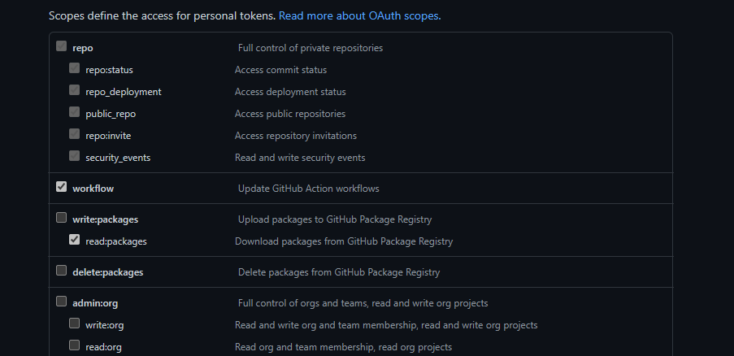
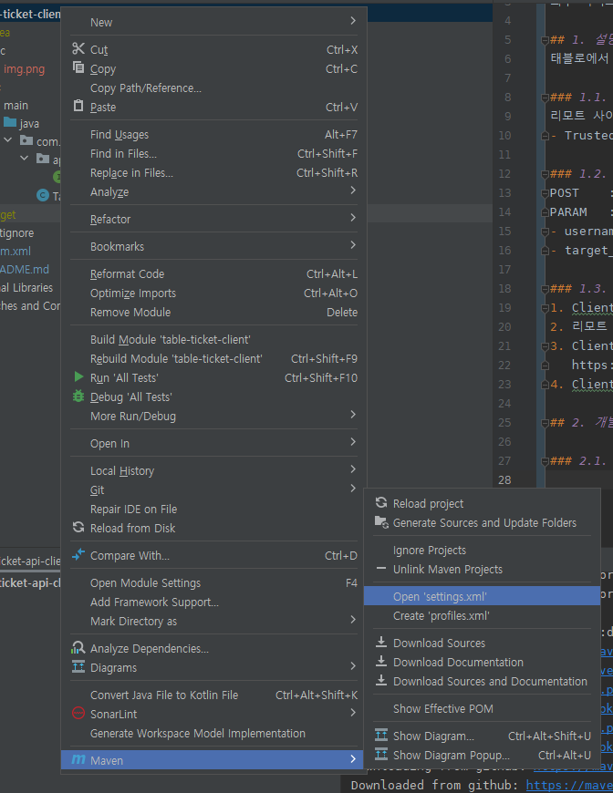

# TABLEAU-API-CLIENT

외부 사이트에서 Tableau 대시보드 접속을 위한 라이브러리 

## 1. 설명
태블로에서 제공하는 신뢰할 수 있는 인증을 이용한 대시보드(View) 접근 방법

### 1.1. 신뢰할 수 있는 IP 주소 추가
리모트 사이트(Web Server)의 IP를 Tableau 서버에 등록
- Trusted Authentication

### 1.2. 티켓 발급 방법
POST 	: https://<tableau_server>/trusted
PARAM 	:
- username 		: tableau 라이선스를 가진 사용자 아이디
- target_site 	: 접근하고자 하는 view가 위치한 tableau 내 사이트

### 1.3. 신뢰할 수 있는 인증과 대시 보드 접근 과정
1. Client의 대시 보드 썸네일 클릭
2. 리모트 사이트(Web Server)는 Tableau Server로부터 티켓을 발급 받음.
3. Client(Web Browser)로 접근 주소 전달
   https://<tableau_server>/trusted/<ticket>/views/<view_name>
4. Client는 해당 주소로 접근

## 2. 개발자 메뉴얼  

github을 이용해 tableau api client를 사용한다. 

### 2.1. github token 생성  

read: packages 권한을 가진 token 을 생성한다. 


### 2.2. Maven - Setting
생성한 Maven settings.xml 파일을 열어 github 정보를 입력한다.


```xml
<?xml version="1.0" encoding="UTF-8"?>
<settings xmlns="http://maven.apache.org/SETTINGS/1.0.0"
          xmlns:xsi="http://www.w3.org/2001/XMLSchema-instance"
          xsi:schemaLocation="http://maven.apache.org/SETTINGS/1.0.0 http://maven.apache.org/xsd/settings-1.0.0.xsd">
    <servers>
        <server>
            <id>github</id>
            <username>id</username>
            <password>token</password>
        </server>
    </servers>
</settings>
```

### 2.3. Maven - pom.xml

pom.xml 파일에 tableau api client 사용을 위해 저장소, 의존성을 추가한다.

```xml
<?xml version="1.0" encoding="UTF-8"?>
<repositories>
   <repository>
      <id>github</id>
      <url>https://maven.pkg.github.com/jblim0125/tableau-api-client</url>
   </repository>
</repositories>

<dependencies>
   <dependency>
      <groupId>com.mobigen</groupId>
      <artifactId>ticket-api-client</artifactId>
      <version>v1.0.0</version>
   </dependency>
</dependencies>
```

### 2.4. Code Sample

Tableau Server 접근을 위한 환경 설정 
```java
import lombok.Getter;
import lombok.Setter;
import org.springframework.boot.context.properties.ConfigurationProperties;
import org.springframework.context.annotation.Configuration;


@Getter
@Setter
@Configuration
@ConfigurationProperties(prefix = "tableau")
public class TableauConfig {
    String url;             // https://tableau-server:port
    String user;            // tableau-id
    String site;            // tableau-id 가 소속된 사이트 
}
```

Tableau API Client를 이용한 토큰 획득과 접속 주소 생성 샘플  
```java
import com.example.demo.config.TableauConfig;
import com.mobigen.ticketclient.TableauApiClient;
import org.springframework.stereotype.Service;

@Service
public class SampleService {
    private final TableauConfig config;

    public SampleService( TableauConfig config ) {
        this.config = config;
    }

    public String getTableauDashboardURL( String site, String workbook, String view ) throws Exception {
        TableauApiClient apiClient = new TableauApiClient( config.getUrl() );
        String token = apiClient.getTicket( config.getUrl(), config.getSite() );
        if( token == null || token.equals( "-1" ) ) {
            throw new Exception( "Error. Failed To Get Token For Access Of Tableau Server" );
        }
        if( site != null && !site.isEmpty() ) {
            return String.format( "%s/trusted/%s/t/%s/views/%s/%s", config.getUrl(), token, site, workbook, view );
        }
        return String.format( "%s/trusted/%s/views/%s/%s", config.getUrl(), token, workbook, view );
    }
}
```